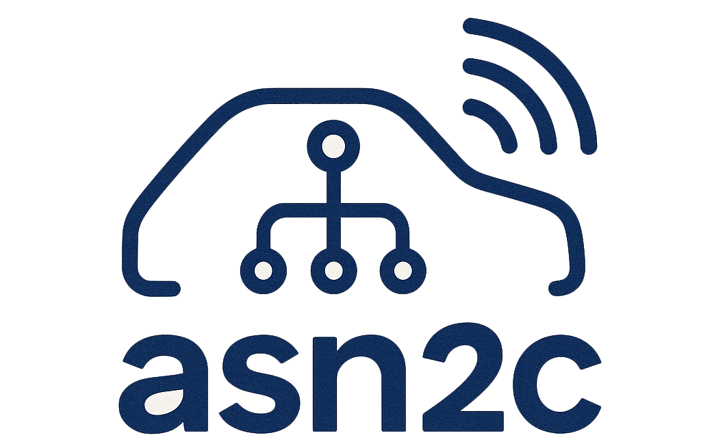

  

# About

asn2c is a project developed at Politecnico di Torino, created by extending and modifying the codebase of the open-source ASN.1 compiler asn1c. The goal of asn2c is to preserve the robustness and maturity of asn1c while introducing new features, improved constraint handling, and a more user-friendly approach to version management and maintainability. Among the enhancements introduced in asn2c are the support for additional ASN.1 constraints, better diagnostic messages, cleaner internal structures for constraint resolution, and several architectural improvements designed to ease future extensions of the compiler.

The original ASN.1 to C compiler (asn1c) takes ASN.1 module files and generates C/C++-compatible source code. This generated code can be used to serialize native C structures into compact and unambiguous BER/OER/PER/XER/JER-based encodings, and to deserialize the resulting data back into structured objects.

ASN.1-based formats are widely adopted across multiple industries. They are used to encode X.509 certificates in HTTPS handshakes, to exchange control messages between mobile phones and cellular networks, and to support car-to-car communication in intelligent transportation systems, among many other applications.

The ASN.1 family of standards is broad and highly complex, and no open-source compiler provides complete coverage of all its features. Nevertheless, asn1c is arguably the most advanced and widely used open-source ASN.1 compiler available today. The asn2c project builds upon this foundation, aiming to push the capabilities of the tool further and to provide a modern, extensible, and developer-friendly environment for ASN.1-to-C code generation.

# ASN.1 Transfer Syntaxes

ASN.1 encodings interoperability table

The ASN.1 family of standards define a number of ways to encode data,
including byte-oriented (e.g., BER), bit-oriented (e.g., PER),
and textual (e.g., XER). Some encoding variants (e.g., DER) are just stricter
variants of the more general encodings (e.g., BER).

The interoperability table below specifies which API functions can be used
to exchange data in a compatible manner. If you need to _produce_ data
conforming to the standard specified in the column 1,
use the API function in the column 2.
If you need to _process_ data conforming to the standard(s) specified in the
column 3, use the API function specified in column 4.
See the [doc/asn1c-usage.pdf](doc/asn1c-usage.pdf) for details.

Encoding       | API function               | Understood by | API function
-------------- | -------------------------- | ------------- | -------------
BER            | der_encode()               | BER           | ber_decode()
DER            | der_encode()               | DER, BER      | ber_decode()
CER            | _not supported_            | CER, BER      | ber_decode()
BASIC-OER      | oer_encode()               | *-OER         | oer_decode()
CANONICAL-OER  | oer_encode()               | *-OER         | oer_decode()
BASIC-UPER     | uper_encode()              | *-UPER        | uper_decode()
CANONICAL-UPER | uper_encode()              | *-UPER        | uper_decode()
BASIC-APER     | aper_encode()              | *-APER        | aper_decode()
CANONICAL-APER | aper_encode()              | *-APER        | aper_decode()
BASIC-XER      | xer_encode(XER_F_BASIC)    | *-XER         | xer_decode()
CANONICAL-XER  | xer_encode(XER_F_CANONICAL)| *-XER         | xer_decode()
JER            | jer_encode()               | JER           | jer_decode()

*) Asterisk means both BASIC and CANONICAL variants.

# Build and Install

If you haven't installed the asn1c yet, read the [INSTALL.md](INSTALL.md) file
for a short installation guide.

# Documentation

For the list of asn1c command line options, see `asn2c -h`.

The comprehensive documentation on this compiler is in [doc/asn1c-usage.pdf](doc/asn1c-usage.pdf).

Please also read the [FAQ](FAQ) file.

An excellent book on ASN.1 is written by Olivier Dubuisson:
"ASN.1 Communication between heterogeneous systems", ISBN:0-12-6333361-0.

# Quick start

(also check out [doc/asn1c-quick.pdf](doc/asn1c-quick.pdf))

After installing the compiler (see [INSTALL.md](INSTALL.md)), you may use
the asn1c command to compile the ASN.1 specification:

    asn2c <module.asn1>                         # Compile module

If several specifications contain interdependencies, all of them must be
specified at the same time:

    asn2c <module1.asn1> <module2.asn1> ...     # Compile interdependent modules

The asn1c source tarball contains the [examples/](examples/) directory
with several ASN.1 modules and a [script](examples/crfc2asn1.pl)
to extract the ASN.1 modules from RFC documents.
Refer to the [examples/README](examples/README) file in that directory.

To compile the X.509 PKI module:

    ./asn1c/asn2c -P ./examples/rfc3280-*.asn1  # Compile-n-print

In this example, the **-P** option is to print the compiled text on the
standard output. The default behavior is that asn1c compiler creates
multiple .c and .h files for every ASN.1 type found inside the specified
ASN.1 modules.

The compiler's **-E** and **-EF** options are used for testing the parser and
the semantic fixer, respectively. These options will instruct the compiler
to dump out the parsed (and fixed) ASN.1 specification as it was
"understood" by the compiler. It might be useful for checking
whether a particular syntactic construction is properly supported
by the compiler.

    asn2c -EF <module-to-test.asn1>             # Check semantic validity
# Difference from asn1c

asn2c is a branched version of asn1c, designed to compile the new IEEE 1609.2.1 ASN.1 files
that were not initially supported by asn1c.
asn2c include a verbose way to check the dependencies of the ASN.1 files processed.

# Model of operation

The asn2c compiler works by processing the ASN.1 module specifications
in several stages:
1. During the first stage, the preproccessing layer analyze all the ASN.1 files and
    and checks for dependencies or for not supported structures.
2. During the second stage, the ASN.1 file is parsed.
   (Parsing produces an ASN.1 syntax tree for the subsequent levels)
3. During the third stage, the syntax tree is "fixed".
   (Fixing is a process of checking the tree for semantic errors,
   accompanied by the tree transformation into the canonical form)
4. During the fourth stage, the syntax tree is compiled into the target language.

There are several command-line options reserved for printing the results
after each stage of operation:

    <parser> => print                                       (-E)
    <parser> => <fixer> => print                            (-E -F)
    <parser> => <fixer> => <compiler> => print              (-P)
    <parser> => <fixer> => <compiler> => save-compiled      [default]

-- 

